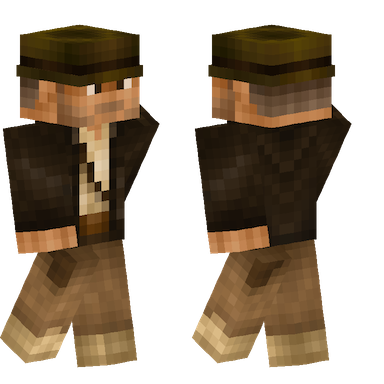
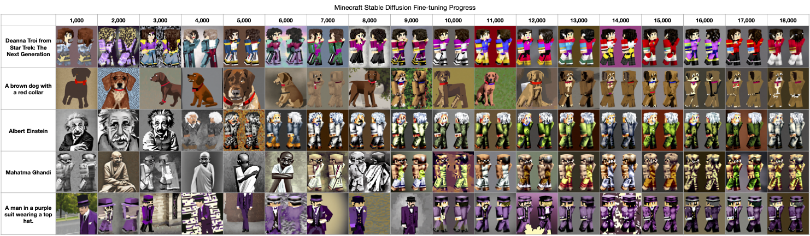

# Fine-tuning Stable Diffusion on a Minecraft Dataset

## Overview

Minecraft is the immensely popular sandbox video game that allows players to embark on endless adventures in a vast worlds made entirely of blocks.   As part of the game experience, players are able to customize their character's appearance through the use of skins, allowing for unique and personalized avatars.

In this tutorial, we're going to fine-tune a Stable Diffusion model to create Minecraft-style characters, based soley on a text prompt provided to our model.


## Overview of the training dataset

The 1022 Minecraft character images we'll be using to train the model are available as a [dataset](https://huggingface.co/datasets/monadical-labs/minecraft-preview) from Hugging Face.  

In the Hugging Face "Dataset Preview", you can see that each training image consists of two renders of each skin; one rendered from the front, and the second from the rear.  

Here's an example image:



Each image also has an associated text description.  For our image above, the corresponding description is:

> A fictional American adventurer, professor of archaeology, and central protagonist of the Indiana Jones franchise.


Let's turn these images into a fine-tuned model!

## Setting Up the training environment

1. We're going to be using a script included with the Hugging Face Diffusers library to fine-tune our model.  First, let's check out the most recent copy of the Diffusers library, and cd into that directory:

    ```bash
    $ git clone https://github.com/huggingface/diffusers
    $ cd diffusers
    ```

1. If you're training on a remote server, such as an instance in Google Cloud or AWS, you may wish to start the training process within a 'screen' session.  Screen will ensure the process doesn't get interupted if, for example, the SSH connection is interupted.
    ```shell
    $ screen
    ```
    
1. Next, create a new Python environment with pipenv:
    ```shell
    $ pipenv shell
    ```

1. We can install the Hugging Face Diffusers library we've checked out of git as follows:
    ```shell
    $ pip install .
    ```

1. Switch into the examples/text_to_image directory, and install the Python modules required by the training scripts:
    ```shell
    $ cd examples/text_to_image
    $ pip install -r ./requirements.txt 
    ````
    
1. Next, initialize an accelerate environment.  Using accelerate allows us to seamlessly train on all GPUs available on the system, without having to write additional code:
    ```shell
    $ accelerate config
    ```
    
1. The training dataset can be cloned with git into the current directory as follows:

    ```shell
    $ git clone git@hf.co:datasets/monadical-labs/minecraft-preview
    ```

With everything installed, we can start the training process.

## Fine-tuning the Stable Diffusion model

First, we'll set some environment variables:

```bash
    $ export SD_MODEL_NAME="stabilityai/stable-diffusion-2"
    $ export SD_MODEL_RES=768
    $ export DATASET="monadical-labs/minecraft-preview"
    $ export SAVE_STEPS=1000
    $ export MAX_STEPS=18000
    $ export MODEL_DIR="minecraft-model"
```

**\$SD_MODEL_NAME** tells our training script that we want to use the Stable Diffusion 2 model, which has a higher output resolution than the original Stable Diffusion. 
If you wish, for some reason, to use the original Stable Diffusion model, change **\$SD_MODEL_RES** to 512.  You will also need to scale the dataset images from 768x768 down to 512x512.

**\$DATASET** indicates that we'll be using the Hugging Face Minecraft-preview dataset that we looked at earlier in the article.

**\$SAVE_STEPS** tells the training script that we want to save a checkpoint of the model every 1000 training steps.  Depending on the number and type of GPU you will be using for training, saving checkpoints regularly with allow you to resume training without losing too much work, should the training script be interrupted for any reason.

**\$MAX_STEPS** indicates that we will be training the model for a maximum of 18,000 steps, after which a usable model will be written out to **\$MODEL_DIR**.

With these environment variables set, we're ready to start training!  Launch the train_text_to_image.py script using accelerate as follows:

```bash
    $ accelerate launch --mixed_precision="fp16" train_text_to_image.py \
        --pretrained_model_name_or_path=$SD_MODEL_NAME \
        --dataset_name=$DATASET \
        --use_ema \
        --resolution=$SD_MODEL_RES  \
        --train_batch_size=1 \
        --gradient_accumulation_steps=4 \
        --gradient_checkpointing \
        --checkpointing_steps=$SAVE_STEPS \
        --max_train_steps=$MAX_STEPS \
        --learning_rate=1e-05 \
        --max_grad_norm=1 \
        --lr_scheduler="constant" --lr_warmup_steps=0 \
        --output_dir=$MODEL_DIR \
```

This process will probably take quite some time. On an NVidia RTX A6000, for example, the training process took in excess of 18 hours.

It should be noted that each of the checkpoint directories takes up 10-15GB of disk space, so you'll need to have several hundred gigabytes available to save all 18 checkpoints, plus the final model.  If this isn't an option, you can increase the **\$SAVE_STEPS** environment variable so that fewer checkpoints are written out.

## What to Do if the training script crashes

To resume an interrupted training session, add the "--resume_from_checkpoint latest" flag to the train_text_to_image.py command.  This will load the latest checkpoint saved in the **\$MODEL_DIR** directory.

If the training script crashes while saving a checkpoint folder, that checkpoint may be incomplete or corrupted.  If so, delete the last checkpoint folder, and use the one saved previously.

## Evaluating the results of the fine-tuned model

We can evaluate the fine-tuning progress of the model by looking at the resulting images generated by fixed text prompts at each of the saved checkpoints.  For example, here are the results for five text prompts on each of the 18 checkpoints saved during our training process:



At around the 15,000th training step, we start to see reliable generation of images in a format very similar to our input Minecraft character images.

## Generating a model from a checkpoint

To generate a model from any of the previously saved checkpoints, re-export the **\$MAX_STEPS** with the number of steps for checkpoint, and add the "--resume_from_checkpoint" flag with the name of the checkpoint directory saved in the **\$MODEL_DIR** directory.

For example, to generate a model from the checkpoint saved after 14000 training steps:

```bash
    $ export MAX_STEPS=14000
    $ accelerate launch --mixed_precision="fp16" train_text_to_image.py \
        --pretrained_model_name_or_path=$SD_MODEL_NAME \
        --dataset_name=$DATASET \
        --use_ema \
        --resolution=$SD_MODEL_RES  \
        --train_batch_size=1 \
        --gradient_accumulation_steps=4 \
        --gradient_checkpointing \
        --checkpointing_steps=$SAVE_STEPS \
        --max_train_steps=$MAX_STEPS \
        --learning_rate=1e-05 \
        --max_grad_norm=1 \
        --lr_scheduler="constant" --lr_warmup_steps=0 \
        --output_dir=$MODEL_DIR \
        --resume_from_checkpoint checkpoint-14000
```

## Using the fine-tuned model with Morpheus

Currently, Morpheus downloads all of its models from Hugging Face.  In order to use our newly fine-tuned model with Morpheus, we'll first have to create a Hugging Face account, and then upload our model.

You can follow the Hugging Face documentation found [here](https://huggingface.co/docs/hub/models-uploading).

Once uploaded, you'll need to edit the [models-info.yaml](https://github.com/Monadical-SAS/Morpheus/blob/main/morpheus-server/scripts/models/models-info.yaml) file and update it with information describing our new model.

For our fine-tuned Minecraft model, you might add:

```yaml
name: Minecraft Character Previews
description: A fine-tuned Stable Diffusion model that generates Minecraft-style character previews
source: monadical-labs/minecraft-preview
```

Then, run the following command from the terminal to download and install the new model:

```bash
docker compose run --rm model-script upload local sdiffusion
```

## Conclusion

That's it!  We've fine-tuned a new Stable Diffusion model on a custom dataset, and made it available for use with Morpheus.  We're looking forward to seeing what the Morpheus community creates!

## Author

Please send any comments or questions to:  Cory Spencer \<cory@monadical.com\>
